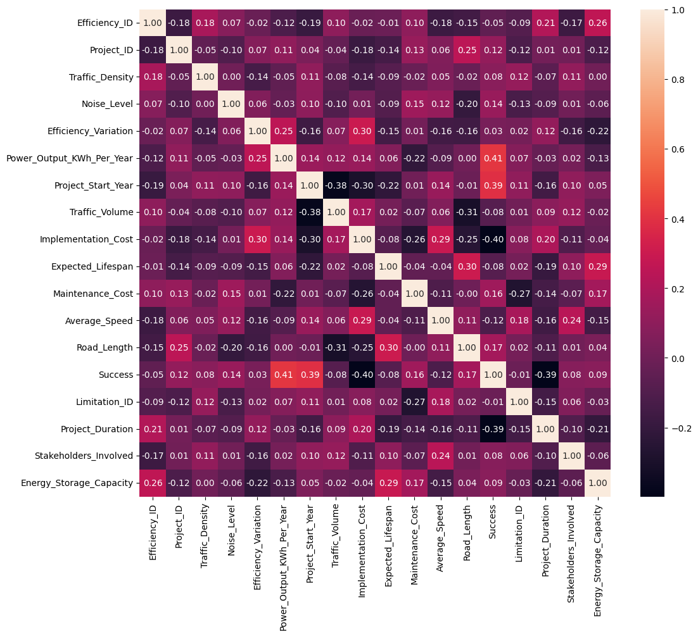
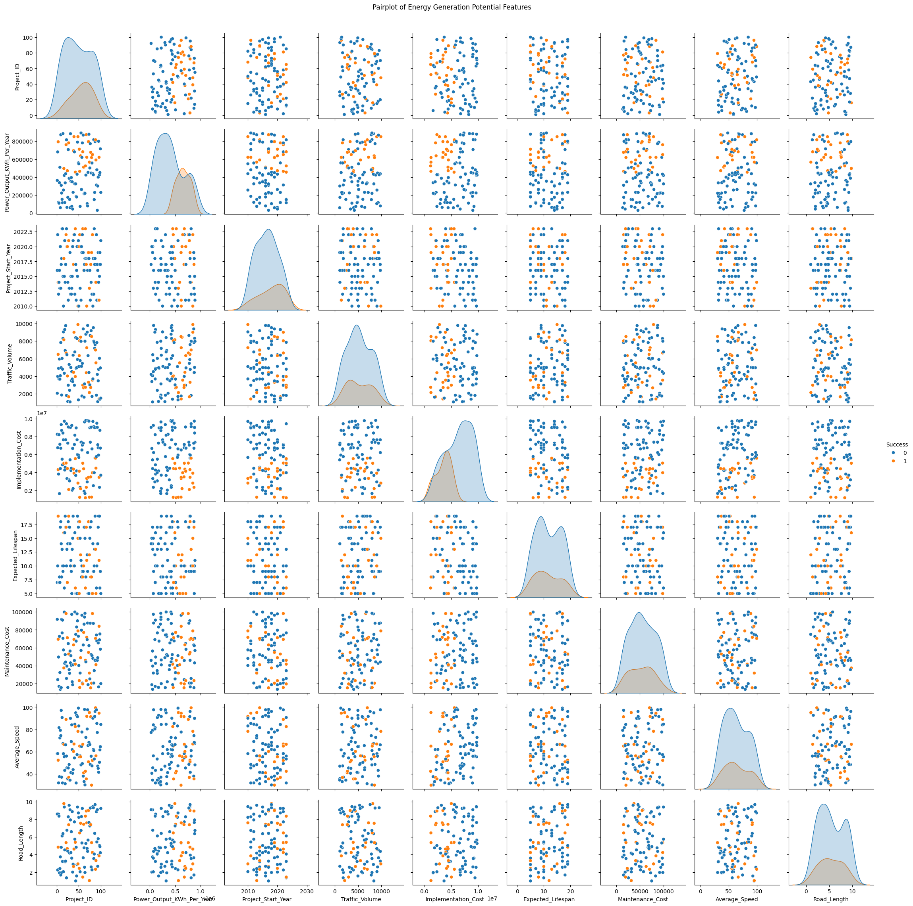
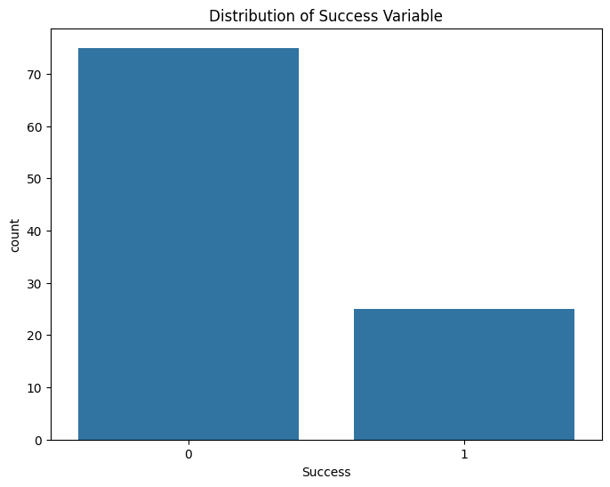
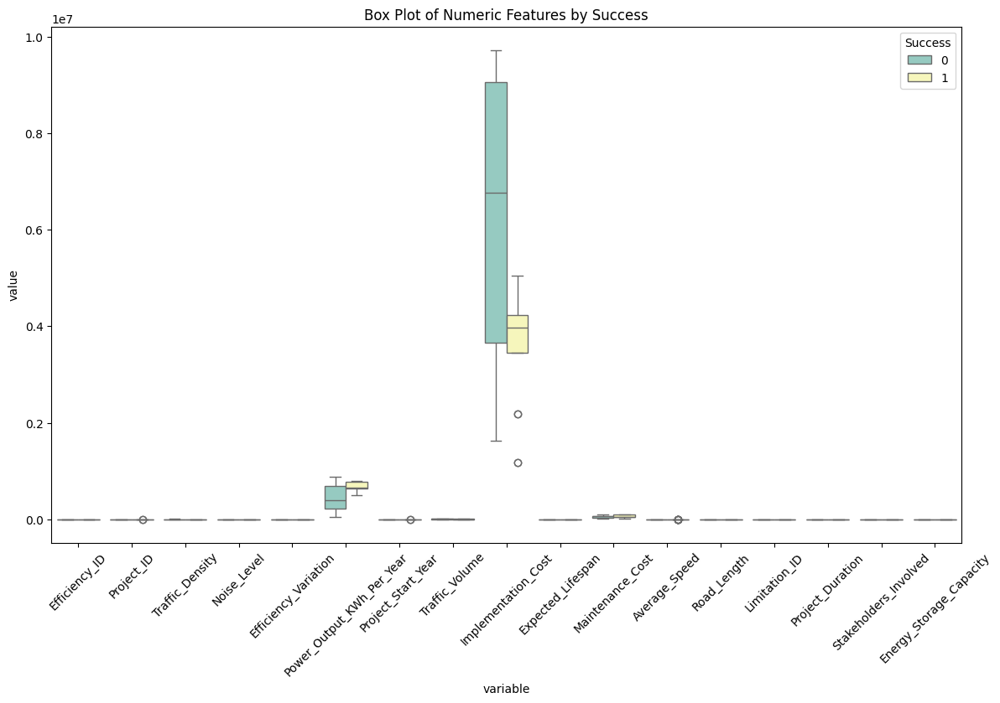
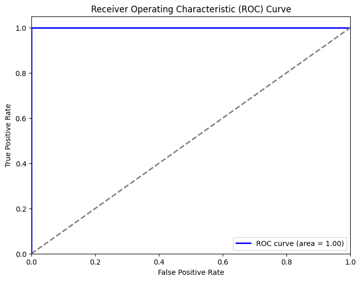
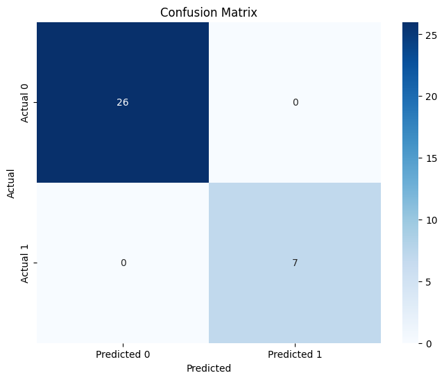

# Piezoelectric Road - Implementation Analysis

This project analyzes the potential and effectiveness of piezoelectric roads for generating energy. It involves merging multiple datasets, training a logistic regression model to predict the success of piezoelectric road implementations, and visualizing various aspects of the data and model performance.

## Table of Contents

- [Introduction](#introduction)
- [Datasets](#datasets)
- [Project Structure](#project-structure)
- [Installation](#installation)
- [Usage](#usage)
- [Models and Visualizations](#models-and-visualizations)
- [Results](#results)
- [Contributing](#contributing)
- [License](#license)

## Introduction

Piezoelectric roads have the potential to generate energy from the vibrations caused by vehicles. This project aims to:
- Analyze the energy generation potential of piezoelectric roads.
- Evaluate the efficiency and durability of the technology.
- Understand the limitations and considerations of large-scale implementations.
- Predict the success and future implementation costs using machine learning models.

## Datasets

The project uses three main datasets:
1. `Energy_Generation_Potential_Expanded.csv`
2. `Efficiency_and_Durability_Expanded.csv`
3. `Limitations_and_Considerations_Expanded.csv`

## Project Structure

```
piezoelectric-road-analysis/
│
├── data/
│   ├── Energy_Generation_Potential_Expanded.csv
│   ├── Efficiency_and_Durability_Expanded.csv
│   └── Limitations_and_Considerations_Expanded.csv
│
├── notebooks/
│   ├── Piezoelectric_Road_Analysis.ipynb
│
├── scripts/
│   ├── analyze_and_predict_with_visualizations.py
│   └── predict_and_visualize_implementation_cost.py
│
├── README.md
└── requirements.txt
```

## Installation

1. Clone the repository:
   ```bash
   git clone https://github.com/yourusername/piezoelectric-road-analysis.git
   cd piezoelectric-road-analysis
   ```

2. Create and activate a virtual environment (optional but recommended):
   ```bash
   python -m venv venv
   source venv/bin/activate  # On Windows use `venv\Scripts\activate`
   ```

3. Install the required packages:
   ```bash
   pip install -r requirements.txt
   ```

## Usage

1. Ensure the datasets are in the `data` directory.
2. Run the analysis and prediction script:
   ```bash
   python scripts/analyze_and_predict_with_visualizations.py
   ```
3. Alternatively, open the Jupyter notebook `notebooks/Piezoelectric_Road_Analysis.ipynb` to interactively run the analysis and visualize the results.

## Models and Visualizations

### Logistic Regression Model

The logistic regression model predicts the success of piezoelectric road implementations based on various features such as power output, implementation cost, efficiency, and durability metrics.

### Visualizations

1. **Correlation Heatmap**: Shows the correlation between different features.
2. **Distribution of Success Variable**: Visualizes the distribution of the target variable (`Success`).
3. **Pairplot**: Illustrates relationships between different features.

     

4. **Count Plots**: Displays distributions of categorical features by success.
5. **Box Plots**: Shows distributions of numerical features by success.

    

6. **ROC Curve**: Visualizes the true positive rate versus the false positive rate.
7. **Confusion Matrix**: Displays the model's performance in terms of true positives, true negatives, false positives, and false negatives.

    

8. **Line Chart**: Shows actual vs. predicted implementation costs over the test set indices.
9. **Feature Importance Bar Plot**: Displays the importance of each feature in predicting the implementation cost.

    

## Results

The logistic regression model achieved the following performance metrics:
- **Accuracy**: 97%
- **Precision**: 100%
- **Recall**: 86%
- **F1 Score**: 92%

These metrics indicate that the model performs well in predicting the success of piezoelectric road implementations.

## Contributing

Contributions are welcome! Please feel free to submit a Pull Request or open an issue.

## License

This project is licensed under the MIT License. See the [LICENSE](LICENSE) file for more details.
