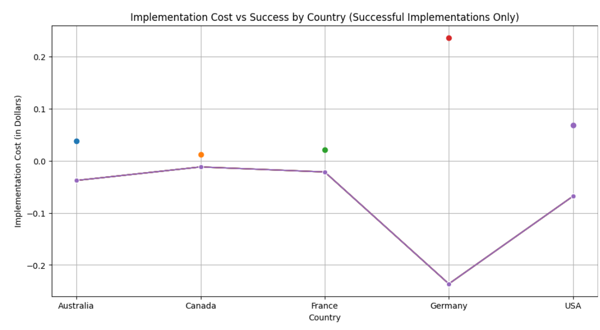
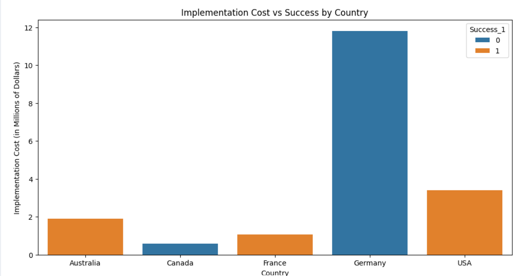

# Implementation of Piezoelectric Roads

This repository contains the code and analysis for the project on implementing piezoelectric roads. The objective of this project is to analyze the potential of piezoelectric materials in road surfaces for generating electricity through vehicular traffic.

## Table of Contents

- [Introduction](#introduction)
- [Dataset](#dataset)
- [Installation](#installation)
- [Notebook Structure](#notebook-structure)
- [Results](#results)
- [Contributing](#contributing)
- [License](#license)

## Introduction

Piezoelectric materials generate electric charge in response to mechanical stress. This project explores the feasibility of using these materials in road surfaces to harness the energy from vehicles. The analysis includes data loading, statistical analysis, feature selection, model training, and evaluation.

## Dataset

The dataset used in this project includes columns related to energy generation potential, efficiency, durability, and various limitations and considerations. The dataset is a generated synthetic data with high-grade prompting and feature engineering.

```txt
data/generated_data.csv      #----->  main dataset
data/future_data.csv         #----->  small generated data to make further predictions
data/scores.csv              #----->  Performance scores of all models
```

## Installation

To run the notebook, you need to have Python and Jupyter Notebook installed. You can install the required libraries using the following commands:

```bash
pip install -r requirements.txt
```

The `requirements.txt` file should include the following libraries:

```txt
numpy
pandas
matplotlib
seaborn
scikit-learn
xgboost
catboost
category_encoders
imblearn
```

## Notebook Structure

The notebook is organized into several sections:

### 0. Import Libraries

In this section, all necessary libraries are imported.

```python
# Basic libraries
import numpy as np
import pandas as pd
import matplotlib.pyplot as plt
import seaborn as sns

# Scikit-learn utilities
from sklearn.feature_selection import SelectKBest, f_classif
from sklearn.model_selection import train_test_split, GridSearchCV
from sklearn.preprocessing import StandardScaler, PolynomialFeatures, LabelEncoder
from sklearn.impute import SimpleImputer
from sklearn.compose import ColumnTransformer
from sklearn.pipeline import Pipeline
from sklearn.utils import shuffle
from imblearn.over_sampling import SMOTE
from sklearn.decomposition import PCA
from sklearn.exceptions import NotFittedError

# Classification models
from sklearn.linear_model import LogisticRegression, SGDClassifier
from sklearn.tree import DecisionTreeClassifier
from sklearn.ensemble import (
    RandomForestClassifier, GradientBoostingClassifier, AdaBoostClassifier, BaggingClassifier
)
from sklearn.svm import SVC
from sklearn.neighbors import KNeighborsClassifier
from sklearn.naive_bayes import GaussianNB
from xgboost import XGBClassifier
from catboost import CatBoostClassifier

# Metrics
from sklearn.metrics import (
    accuracy_score, confusion_matrix, classification_report, precision_score, recall_score, f1_score, roc_curve, auc, roc_auc_score
)

# Encoders
from category_encoders import BinaryEncoder, TargetEncoder, OneHotEncoder

# Additional imports (if required)
import random
import joblib
import warnings
warnings.filterwarnings('ignore')
```

### 1. Data Loading

This section involves loading the dataset and performing initial data exploration.

```python
df = pd.read_csv('DATA/generated_data.csv')
```

### 2. Statistical Analysis

Here, statistical analysis and visualizations of the dataset are performed to understand the distributions and relationships between different variables.

### 3. Data Preprocessing

Data preprocessing steps such as handling missing values, encoding categorical variables, and scaling are conducted in this section.

### 4. Feature Selection

Feature selection techniques are applied to identify the most important features for the model.

### 5. Model Training and Evaluation

Various classification models are trained and evaluated on the dataset. The models used include:

- Logistic Regression
- Stochastic Gradient Descent (SGD) Classifier
- Decision Tree
- Random Forest
- Gradient Boosting
- AdaBoost
- Bagging Classifier
- Support Vector Machine (SVM)
- K-Nearest Neighbors (KNN)
- Naive Bayes
- XGBoost
- CatBoost



### 6. Results

The results of the different models are compared, and the best model is selected. Below is a summary of our findings and future predictions.

- **Best Models**: Decision Tree | XGBoost | Random Forest
- **Accuracy**: 1 | 1 | 0.9733
- **ROC AUC**: 1 | 1 | 0.9560
- **F1 Score**: 1 | 1 | 0.9812

The project demonstrates the potential of using piezoelectric materials in roads for energy generation. The best-performing model is identified based on accuracy and other evaluation metrics.

### Future Predictions

This section highlights the potential future predictions and insights gained from the analysis, focusing on the implementation and scalability of piezoelectric roads.



## Contributing

Contributions are welcome! Please read the [contributing guidelines](CONTRIBUTING.md) for more details.

## License

This project is licensed under the MIT License - see the [LICENSE](LICENSE) file for details.
